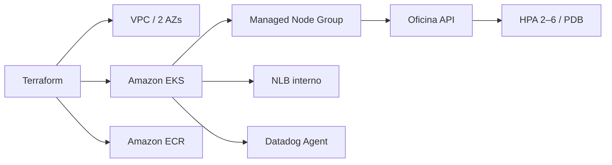

# Oficina Kubernetes Infrastructure

Infraestrutura como código da rede, Amazon EKS, ECR, workloads Kubernetes e observabilidade da oficina.

## Arquitetura



Relacionados: [API](https://github.com/maypinheiro/oficina-api), [autenticação](https://github.com/maypinheiro/oficina-auth-function) e [banco](https://github.com/maypinheiro/oficina-database-infra).

## Tecnologias

Terraform, AWS VPC/EKS/ECR, Kubernetes, HPA, PDB, Metrics Server, External Secrets, Datadog, GitHub Actions e YAML.

## Pré-requisitos

- Terraform 1.6+, AWS CLI e `kubectl`;
- credenciais temporárias da conta Academy `982623100545`;
- chaves Datadog e permissão da `LabRole` para os recursos.

## Execução local e validação

Não há emulador local de EKS. A validação é estática:

```bash
terraform -chdir=infra fmt -check -recursive
terraform -chdir=infra init -backend=false
terraform -chdir=infra validate
kubectl apply --dry-run=client -f k8s/
```

`k8s/postgres.yaml` e `metrics-server.yaml` são legado local e não são aplicados no ambiente AWS.

## Variáveis e secrets

Use `environments/hml.tfvars.example` ou `prod.tfvars.example`. O CD requer `AWS_ACCESS_KEY_ID`, `AWS_SECRET_ACCESS_KEY`, `AWS_SESSION_TOKEN`, `TF_STATE_BUCKET`, `TF_STATE_LOCK_TABLE`, `CLUSTER_PUBLIC_ACCESS_CIDRS_JSON`, `DATADOG_API_KEY` e `DATADOG_APP_KEY`. `DATADOG_ALERT_NOTIFICATION` é variável de environment.

## CI/CD e deploy

CI executa formatação, `terraform validate`, tfsec e validações dos manifests. O CD manual seleciona `hml` ou `prod`, usa backend S3/DynamoDB, aplica Terraform e publica outputs. Depois, banco, autenticação e API são implantados nessa ordem. Consulte [deployment](docs/deployment.md) e [CI/CD](docs/cicd.md).

## Rollback

Reaplique um commit/plan conhecido após revisar o diff. Para workload, reverta ao SHA anterior da imagem. Não edite o state nem destrua EKS/VPC como diagnóstico; recursos stateful pertencem ao repositório de banco.

## Outputs

Incluem VPC, sub-redes privadas, cluster EKS, endpoint, ECR, security groups e listener/NLB interno consumidos pelos demais pipelines.

## Observabilidade

Datadog Agent/Cluster Agent, dashboards de API/Kubernetes/negócio e monitores são versionados. Veja [dashboards](docs/dashboards.md).

## Ambiente ativo e limitações

Cluster ativo: **não publicado nesta etapa**. EKS, node groups, NAT e load balancer geram custo e dependem das quotas, saldo, duração de sessão e permissões do Learner Lab. Se dois clusters não forem viáveis, a contingência documentada é um cluster temporário com namespaces isolados.
