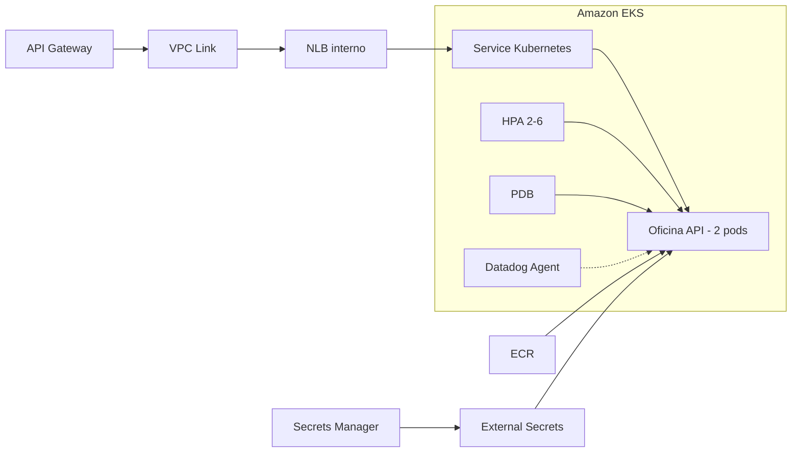

# Oficina Kubernetes Infrastructure

Infraestrutura como código da plataforma Amazon EKS, rede, imagens, workloads Kubernetes, elasticidade e observabilidade da oficina.

## O que este repositório entrega

- VPC em duas AZs, sub-redes públicas/privadas, rotas e NAT configurável;
- Amazon EKS com Managed Node Group e addons essenciais;
- Amazon ECR com imagens imutáveis por SHA;
- NLB interno para integração privada com API Gateway;
- Deployment, Service, probes, requests/limits e segurança não-root;
- HPA de 2 a 6 réplicas e PodDisruptionBudget;
- External Secrets, AWS Load Balancer Controller e Cluster Autoscaler;
- Datadog Agent, dashboards e monitores;
- Terraform e pipelines CI/CD separados por ambiente.



## Documentação

- [Arquitetura, objetivos, decisões e limitações](docs/arquitetura-e-decisoes.md)
- [Procedimento de implantação](docs/deployment.md)
- [CI/CD](docs/cicd.md)
- [Dashboards e monitores](docs/dashboards.md)
- [Governança do repositório](docs/governanca-repositorio.md)
- [Arquitetura integrada da solução](https://github.com/maypinheiro/oficina-api/blob/develop/docs/fase3/entrega-tecnica.md)
- [ADR do EKS](https://github.com/maypinheiro/oficina-api/blob/develop/docs/fase3/adrs/adr-003-amazon-eks.md)
- [ADR do HPA](https://github.com/maypinheiro/oficina-api/blob/develop/docs/fase3/adrs/adr-004-hpa.md)

Repositórios relacionados: [API](https://github.com/maypinheiro/oficina-api), [autenticação](https://github.com/maypinheiro/oficina-auth-function) e [banco](https://github.com/maypinheiro/oficina-database-infra).

## Tecnologias

Terraform, AWS VPC/EKS/ECR, Kubernetes, Helm, HPA, PDB, Metrics Server, External Secrets, Datadog e GitHub Actions.

## Validação local

```bash
terraform -chdir=infra fmt -check -recursive
terraform -chdir=infra init -backend=false
terraform -chdir=infra validate
kubectl apply --dry-run=client -f k8s/
```

Os manifests de PostgreSQL e Metrics Server usados na fase local são legado e não representam o banco cloud. PostgreSQL é executado no RDS.

## CI/CD e ordem de implantação

CI valida Terraform, segurança e manifests. O workflow `Provision EKS` aplica rede/cluster e instala controllers. A ordem cloud é: EKS/rede, RDS, API/migrations e Functions/Gateway. Rollback usa commit/plan ou SHA conhecido; não se edita state nem se destrói o cluster como diagnóstico.

## Ambiente validado e limitações

- Conta acadêmica `982623100545`, região `us-east-1`;
- homologação validada: <https://github.com/maypinheiro/oficina-k8s-infra/actions/runs/34616729840>;
- produção permanece codificada e isolada, condicionada ao orçamento do laboratório.

Credenciais STS do Learner Lab expiram. Controllers que acessam AWS precisam receber a sessão atual; após renovar os secrets do GitHub, execute novamente o provisionamento ou o CD da API. EKS, nodes, NAT e NLB geram custo enquanto ativos.
