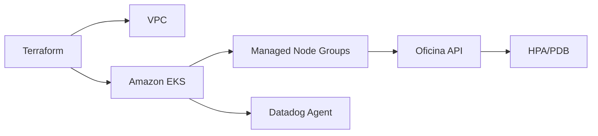

# Oficina Kubernetes Infrastructure

Infraestrutura Kubernetes da oficina mantida com Terraform. Os arquivos atuais
de Kind e manifests foram preservados como baseline da Fase 2 e deverão ser
convertidos para Amazon EKS.

## Responsabilidades

- VPC, sub-redes e componentes de rede necessários ao EKS;
- EKS e Managed Node Groups;
- ambientes `hml` e `prod` isolados logicamente na conta AWS Academy Learner
  Lab `982623100545`;
- HPA, PDB, probes, requests e limits;
- Datadog Agent/Cluster Agent;
- outputs consumidos pelo pipeline da aplicação.

## Estado atual

O diretório `infra/` ainda provisiona Kind. O diretório `k8s/` contém HPA, PDB,
API e também PostgreSQL local. `postgres.yaml` não será aplicado em cloud porque
o banco da Fase 3 será Amazon RDS no repositório independente de banco.

## Limitações do Learner Lab

- permissões e quotas de EKS/IAM precisam ser validadas antes do apply;
- dois clusters são o alvo, mas um EKS com namespaces separados é a contingência
  se saldo ou quotas impedirem o isolamento físico;
- homologação deve ser temporária sempre que possível;
- OIDC será usado se permitido; caso contrário, a pipeline receberá credenciais
  temporárias por GitHub Environment, nunca pelo código.

## Validação técnica

```bash
terraform -chdir=infra fmt -check -recursive
terraform -chdir=infra init -backend=false
terraform -chdir=infra validate
```

## Arquitetura


