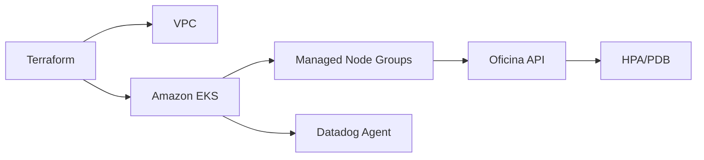

# Oficina Kubernetes Infrastructure

Infraestrutura Kubernetes da oficina mantida com Terraform. Os arquivos atuais
de Kind e manifests foram preservados como baseline da Fase 2 e deverão ser
convertidos para Amazon EKS.

## Responsabilidades

- VPC, sub-redes e componentes de rede necessários ao EKS;
- EKS e Managed Node Groups;
- namespaces de homologação/produção em contas distintas;
- HPA, PDB, probes, requests e limits;
- Datadog Agent/Cluster Agent;
- outputs consumidos pelo pipeline da aplicação.

## Implementacao cloud

- VPC em duas AZs, sub-redes publicas/privadas e NAT unico;
- EKS com logs de auditoria e endpoint administrativo restrito;
- Managed Node Group com scaling por ambiente;
- ECR com tags imutaveis e scan no push;
- NLB interno para integracao privada com API Gateway;
- namespaces `oficina-hml` e `oficina-prod`;
- HPA, PDB, rolling update, probes, requests e limits;
- External Secrets com AWS Secrets Manager;
- Job Prisma executado antes do rollout.

`postgres.yaml` e `metrics-server.yaml` sao preservados apenas como legado local
e nao sao aplicados na AWS. Consulte `docs/deployment.md` para a ordem de deploy.

## Estado anterior

O diretório `infra/` ainda provisiona Kind. O diretório `k8s/` contém HPA, PDB,
API e também PostgreSQL local. `postgres.yaml` não será aplicado em cloud porque
o banco da Fase 3 será Amazon RDS no repositório independente de banco.

## Validação

```bash
terraform -chdir=infra fmt -check -recursive
terraform -chdir=infra init -backend=false
terraform -chdir=infra validate
```

## Arquitetura



