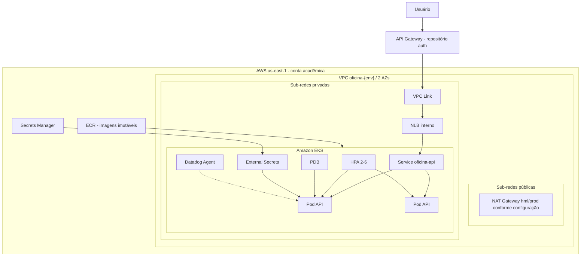
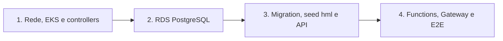

# Arquitetura e decisões técnicas

## Objetivo

Este repositório entrega a plataforma cloud onde a API da oficina é executada: rede, EKS, ECR, balanceamento privado, recursos Kubernetes, elasticidade e observabilidade do cluster.

Banco de dados, código da API e Functions são mantidos em repositórios independentes e consomem os outputs desta infraestrutura.

## Mapa da infraestrutura

## Recursos entregues

| Camada | Entrega |
|---|---|
| Rede | VPC, duas AZs, sub-redes públicas/privadas, rotas, Internet Gateway e NAT configurável |
| Kubernetes | EKS, Managed Node Group, addons essenciais e acesso controlado ao endpoint |
| Imagens | ECR com criptografia, scan e tags imutáveis |
| Entrada privada | Service LoadBalancer, NLB interno, target type IP e health check HTTP `/health` |
| Workload | Deployment com duas réplicas, probes, limites, usuário não-root e rolling update |
| Disponibilidade | HPA de 2 a 6 réplicas e PodDisruptionBudget |
| Segredos | External Secrets sincronizando AWS Secrets Manager |
| Operação | AWS Load Balancer Controller, Metrics Server e Cluster Autoscaler |
| Observabilidade | Datadog Agent/Cluster Agent, dashboards e monitores versionados |

## Decisões técnicas

### EKS e API stateless

Amazon EKS atende ao requisito de Kubernetes em cloud e permite demonstrar rollout, self-healing e HPA. Somente a API stateless é escalada; PostgreSQL permanece no RDS e Functions escalam pelo serviço Lambda.

### Duas AZs e NLB interno

Os nodes e o NLB utilizam sub-redes privadas distribuídas em duas AZs. O NLB não é publicado diretamente na internet; o acesso externo passa pelo API Gateway e VPC Link.

### HPA por CPU e memória

O HPA usa `autoscaling/v2`, mínimo 2 e máximo 6 réplicas, com metas de CPU e memória. O Metrics Server fornece os sinais. O Cluster Autoscaler pode solicitar capacidade de node, condicionado às permissões e quotas do laboratório.

### Segurança do container

O processo roda como UID/GID não-root, sem privilege escalation e sem Linux capabilities. Readiness e liveness usam `/health`. Requests e limits tornam o agendamento previsível e permitem o cálculo do HPA.

### Secrets externos

Configurações não sensíveis usam ConfigMap. Credenciais de banco e chaves ficam no Secrets Manager e chegam ao namespace pelo External Secrets. Nenhum segredo real é versionado em YAML.

### Estado Terraform remoto

Cada ambiente usa chave de state independente em S3 e lock em DynamoDB. `hml` e `prod` também possuem namespaces, tags, secrets e parâmetros distintos.

## Ambientes

| Aspecto | Homologação | Produção |
|---|---|---|
| Branch | `homolog` | `main` |
| Terraform state | `k8s/hml/terraform.tfstate` | `k8s/prod/terraform.tfstate` |
| Namespace | `oficina-hml` | `oficina-prod` |
| Dados | Sintéticos | Sem compartilhamento com hml |
| Aprovação | Environment hml | Environment prod com aprovação |

A infraestrutura de produção está codificada, mas a evidência cloud desta etapa foi executada em homologação para respeitar orçamento e limitações do Learner Lab.

## Ordem de implantação

Controllers que usam AWS recebem credenciais temporárias do laboratório. Após iniciar uma nova sessão, execute novamente `Provision EKS` ou o CD da API para atualizar esses secrets antes de diagnosticar NLB ou External Secrets.

## Observabilidade

Três dashboards são mantidos como Terraform: API, Kubernetes e negócio. Monitores cobrem disponibilidade, 5xx, latência, falhas de OS, restarts, pods indisponíveis e saturação. Tags mínimas: `service`, `env` e `version`.

## Rollback e recuperação

- Infraestrutura: reaplicar commit/plan conhecido após revisão.
- Workload: selecionar SHA imutável anterior no ECR.
- Banco: não pertence a este state e nunca deve ser destruído para corrigir rollout.
- State: não editar manualmente nem executar destroy como diagnóstico.

## Limitações do AWS Academy

- Conta `982623100545` e região `us-east-1`.
- `LabRole`, quotas, saldo e duração da sessão limitam recursos.
- Credenciais estáticas temporárias são uma contingência acadêmica; IRSA/OIDC permanece evolução quando permitido.
- EKS, nodes, NAT e NLB geram custo enquanto ativos.
- A contingência de orçamento é manter produção codificada e demonstrar homologação isolada.

## Evidência validada

Terraform, EKS, nodes, controllers e artefatos foram validados em homologação: <https://github.com/maypinheiro/oficina-k8s-infra/actions/runs/34616729840>.

## Rastreabilidade para avaliação

| Requisito | Implementação |
|---|---|
| Kubernetes cloud | `infra/cluster.tf` |
| Rede em duas AZs | `infra/network.tf` |
| Escalabilidade | `k8s/hpa.yaml` e Cluster Autoscaler no CD |
| Disponibilidade | `k8s/api-pdb.yaml`, probes e duas réplicas em `k8s/api.yaml` |
| Imagem cloud | ECR em `infra/cluster.tf` |
| Secrets | `k8s/cluster-secret-store.yaml` e `k8s/secret.yaml` |
| CPU/memória/HPA | `observability/datadog-values.yaml` e dashboard Kubernetes |
| Dashboards | `infra/dashboards.tf` e `infra/dashboards/*.json.tftpl` |
| Alertas | `infra/observability.tf` |
| CI/CD | `.github/workflows/ci.yml` e `cd.yml` |

Matriz completa: <https://github.com/maypinheiro/oficina-api/blob/main/docs/fase3/matriz-conformidade.md>.
